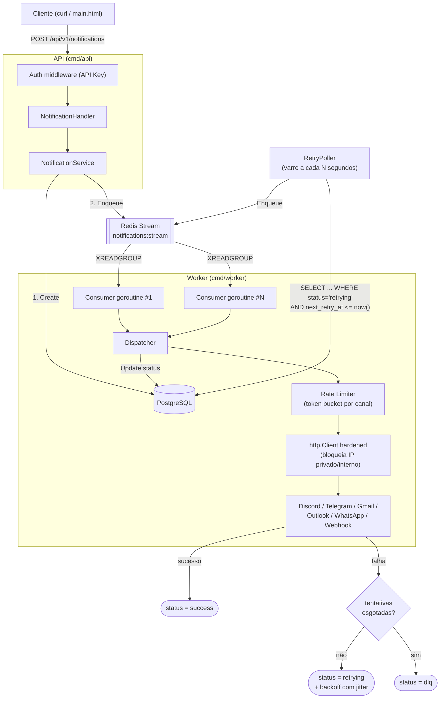

# Arquitetura — Notification Engine

Este documento explica **como o sistema funciona por dentro** e **por que** as
decisões técnicas mais importantes foram tomadas. Para instruções de uso, veja
o [README.md](README.md).

---

## Visão geral



O fluxo em uma frase: a API valida, persiste no Postgres e publica no Redis;
o worker consome em paralelo, aplica rate limit, dispara pro canal externo e
grava o resultado de volta no Postgres — que é a única fonte de verdade sobre
o que fazer a seguir (retry, DLQ ou sucesso).

---

## Por que Redis Streams (e não Pub/Sub ou uma fila tradicional)?

**Pub/Sub puro** (`PUBLISH`/`SUBSCRIBE`) foi descartado porque não persiste
mensagem nenhuma: se não houver um assinante conectado no exato momento do
`PUBLISH`, a mensagem se perde — inaceitável para notificações que o usuário
espera que sejam entregues mais cedo ou mais tarde.

**Redis Streams** (`XADD`/`XREADGROUP`) resolve isso porque:

- A mensagem fica persistida no stream até ser explicitamente confirmada
  (`XACK`) ou o stream ser truncado — um consumidor que reinicia não perde
  nada que ainda não processou.
- **Consumer Groups** permitem múltiplos workers (goroutines, ou processos
  inteiros em máquinas diferentes) lerem do **mesmo** stream sem processar a
  mesma mensagem duas vezes: o Redis garante que cada mensagem vá para
  exatamente um consumidor do grupo.
- Cada consumidor tem sua própria **Pending Entries List (PEL)** — a lista de
  mensagens que já recebeu mas ainda não confirmou. Isso é o que permite
  recuperar mensagens de um worker que caiu no meio do processamento (veja
  XAUTOCLAIM abaixo).

Uma fila gerenciada (SQS, RabbitMQ) resolveria o mesmo problema, mas exigiria
mais uma peça de infraestrutura para rodar/operar. Como o projeto já usa
Redis para outras coisas, reaproveitar Streams evita essa peça extra sem
abrir mão de nenhuma garantia importante para o caso de uso.

---

## Consumer Group: como o paralelismo funciona

```
notifications:stream
        │
        ▼
  Consumer Group "notification-workers"
   ├── worker-1-0  (goroutine 0)
   ├── worker-1-1  (goroutine 1)
   ├── worker-1-2  (goroutine 2)
   └── ...          (WORKER_CONCURRENCY goroutines)
```

Cada goroutine roda um `queue.RedisConsumer` com um **nome de consumidor
único** (`worker-1-0`, `worker-1-1`...) dentro do **mesmo** grupo
(`notification-workers`). O Redis distribui as mensagens entre eles — nunca
entrega a mesma mensagem a dois consumidores do grupo ao mesmo tempo. Isso dá
paralelismo real (várias notificações sendo processadas ao mesmo tempo) sem
nenhuma lógica de coordenação manual no código: a garantia vem do próprio
Redis.

Rodar múltiplas **instâncias do processo worker** (não só goroutines dentro
de um processo) funciona do mesmo jeito, contanto que cada uma use um
`REDIS_CONSUMER_NAME` diferente — o `WORKER_CONCURRENCY` de cada instância
soma ao paralelismo total.

---

## Garantias de entrega: at-least-once, nunca exactly-once

O sistema entrega **pelo menos uma vez** (*at-least-once*), nunca
exatamente uma vez (*exactly-once*). Isso é uma escolha deliberada — Redis
Streams, como a maioria dos sistemas de fila reais, não oferece
exactly-once de graça, e simular isso custaria muita complexidade adicional
(transações distribuídas, deduplicação por mensagem) para um ganho marginal
na prática.

Situações que podem gerar uma segunda tentativa de entrega da **mesma**
notificação:

1. **Reivindicação de mensagem presa (XAUTOCLAIM)** — se um worker processa a
   notificação, mas cai (crash, `kill -9`) *depois* de enviar ao canal
   externo e *antes* de confirmar (`XACK`), a mensagem continua na PEL. Outro
   consumidor a reivindica após `claimMinIdle` (30s) e tenta de novo — o
   destinatário pode receber a notificação duas vezes.
2. **Retry automático após falha** — por natureza do próprio recurso: se o
   canal externo respondeu com erro mas na verdade processou a requisição
   (ex: timeout de rede na resposta, não na requisição), o retry reenvia uma
   notificação que talvez já tenha chegado.

### Como o cliente se protege de duplicidade

O **Idempotency-Key** (header `Idempotency-Key` em `POST
/api/v1/notifications`) resolve a duplicidade **do lado do cliente**: se o
seu client-side reenviar a mesma requisição HTTP (ex: após um timeout, sem
saber se a primeira tentativa chegou), a API detecta a chave repetida (índice
único no Postgres) e devolve a notificação já criada, sem enfileirar de novo.

Isso cobre o caso mais comum de duplicidade (o cliente não sabe se a
requisição chegou). Os dois casos acima (XAUTOCLAIM e retry automático) são
duplicidade *depois* que a notificação já foi aceita — mitigá-los
completamente exigiria que os canais de destino (Discord, Telegram, e-mail)
também fossem idempotentes, o que foge do controle desta engine. Na prática,
duplicidade nesse nível é rara (só ocorre em janelas de falha específicas) e
o trade-off (simplicidade vs. garantia perfeita) é o mesmo que a maioria dos
sistemas de mensageria em produção aceita.

---

## Retry: backoff exponencial com jitter

```
tentativa 1 falha → próxima tentativa em algo entre 1s e 2s
tentativa 2 falha → próxima tentativa em algo entre 1s e 4s
tentativa 3 falha → próxima tentativa em algo entre 1s e 8s
...
tentativa N falha → teto de RETRY_MAX_BACKOFF_SECONDS (default 3600s)
```

O atraso não é um valor fixo — é sorteado uniformemente entre 1s e o teto
daquela tentativa (`retry.NextBackoff`, um "full jitter"). Isso evita que um
lote de notificações que falhou no mesmo instante (ex: o Discord ficou fora
do ar por 10 segundos) seja reenviado todo de uma vez, no mesmo milissegundo
— o que só recriaria o pico de tráfego que provavelmente causou a falha
original.

Quando as tentativas se esgotam (`Attempts >= MaxAttempts`), a notificação
vai para a **DLQ** (`status = dlq`) e fica parada até uma ação manual: `POST
/notifications/{id}/retry`, o botão "Retry" no dashboard, ou `/retry <id>` no
bot do Telegram — todos zeram `Attempts` para dar um ciclo novo completo.

---

## Consistência entre PostgreSQL e Redis

O Postgres é a fonte de verdade sobre o *estado* de uma notificação; o Redis
é só o *transporte* que avisa o worker que há algo novo para processar. Um
problema possível: e se o Postgres gravar a notificação com sucesso, mas o
`XADD` no Redis falhar logo em seguida (rede instável, Redis reiniciando)?

Sem tratamento, a notificação ficaria presa em `status=pending` para sempre —
persistida, mas sem nenhum processo responsável por ela (o worker nunca
saberia que ela existe, porque nunca chegou ao stream).

A solução: quando `Enqueue` falha logo após `Create`, o service trata isso
como uma falha de entrega comum — a mesma lógica usada quando um canal
externo (Discord, Gmail...) rejeita a notificação (`retry.ApplyFailure`).
A notificação recebe `status=retrying` com um backoff calculado, e o
**RetryPoller** do worker (que já varre o Postgres periodicamente por
notificações com retry vencido) a reenfileira automaticamente assim que o
prazo chega — sem exigir nenhum componente novo, e sem risco de entrega
duplicada (a notificação nunca chegou a ser enfileirada da primeira vez).

Essa abordagem é deliberadamente mais simples que um *Transactional Outbox*
completo (tabela de eventos + processo publisher dedicado): resolve o mesmo
problema de órfãos, reaproveitando uma peça que o sistema já tinha (o
RetryPoller), com uma fração da complexidade operacional. Um outbox real
faria sentido se o sistema precisasse de garantias mais fortes de ordenação
ou operasse múltiplas instâncias de banco — não é o caso aqui.

---

## Proteção contra SSRF (Server-Side Request Forgery)

Os canais **Discord** e **Webhook genérico** fazem uma requisição HTTP para
uma URL fornecida pelo cliente da API (`target`). Sem proteção, isso permite
que alguém use a engine como proxy para acessar redes internas — por
exemplo, apontando `target` para `http://169.254.169.254/latest/meta-data`
(o endereço de metadados de nuvem da AWS/GCP/Azure, que costuma expor
credenciais) ou para `http://localhost:5432` (o próprio banco de dados).

Duas camadas de defesa (`internal/security`):

1. **Checagem síncrona na criação** (`ValidateTargetURL`) — rejeita
   esquemas diferentes de `http`/`https`, `localhost`, e literais de IP já
   reconhecidamente privados/loopback/link-local. Rápida (sem I/O de rede),
   dá feedback imediato (400) ao cliente da API.
2. **`http.Client` hardened no momento do envio** (`SafeHTTPClient`) — o
   `Transport.DialContext` resolve o hostname via DNS e recusa a conexão se
   **qualquer** IP resolvido cair numa faixa bloqueada. Isso fecha a brecha
   que a camada 1 não cobre sozinha: um hostname público no momento da
   criação que passa a resolver para um IP interno depois (*DNS rebinding*).
   É essa camada que efetivamente protege o sistema — a primeira é só uma
   otimização de UX.

O canal **Discord** ainda tem uma terceira camada específica: o host do
`target` precisa terminar em `discord.com` ou `discordapp.com`. Isso não é
sobre SSRF (que já está coberto pelas duas camadas acima) — é para impedir
que o canal "discord" seja usado como um proxy HTTP genérico para qualquer
servidor público.

`ALLOW_PRIVATE_NETWORK_TARGETS=true` desliga as três camadas — existe só
para testar contra serviços internos em desenvolvimento; nunca deveria ser
ligado em produção.

---

## Canais Outlook e WhatsApp: por que não têm superfície de SSRF

Diferente de webhook/discord, os canais **Outlook** e **WhatsApp** não
recebem uma URL do cliente da API — `target` é um e-mail ou um número de
telefone, e a requisição HTTP sempre vai para um host fixo do próprio
provedor (`graph.microsoft.com`, `graph.facebook.com`). Não há como o
cliente da API redirecionar essa chamada para outro lugar, então esses dois
senders usam um `http.Client` comum, sem o hardening contra SSRF que
webhook/discord precisam.

**Outlook** autentica via OAuth2 *client credentials* (fluxo de aplicativo,
sem usuário interativo) — o `OutlookSender` cacheia o token de acesso em
memória e só busca um novo quando o cacheado está perto de expirar
(`tokenRefreshMargin` de 60s de antecedência), em vez de autenticar a cada
envio. Chamadas concorrentes disputam o mesmo mutex; só uma de fato busca
um token novo quando o cache expira, as demais reaproveitam o resultado.

**WhatsApp** exige um Message Template pré-aprovado pela Meta para qualquer
mensagem que a empresa inicie (alertas, avisos) fora de uma janela de
conversa de 24h — texto livre só é aceito pela API dentro dessa janela
(quando o destinatário mandou mensagem recentemente). Por isso
`domain.Notification` tem `TemplateName`/`TemplateLocale`/`TemplateParams`
como uma alternativa a `Message`: notificações de negócio (a maioria dos
casos de alerta/aviso) devem usar template; texto livre é a exceção, não a
regra, para esse canal.

---

## Autenticação e autorização

- **API** (`API_KEY`): quando configurada, todo endpoint de negócio
  (`/api/v1/*`) exige `Authorization: Bearer <chave>` ou `X-API-Key:
  <chave>`. `/health`, `/health/live`, `/health/ready` e `/metrics` ficam
  sempre abertos (health checks e scraping do Prometheus não costumam
  carregar credenciais).
- **Bot do Telegram** (`TELEGRAM_ALLOWED_CHAT_IDS`): restringe quem pode
  executar `/retry` e `/status` a uma lista de `chat_id`. Sem essa lista,
  qualquer pessoa que descubra o bot pode reenfileirar ou consultar
  notificações — aceitável só em ambiente de desenvolvimento fechado.

Ambos são opcionais e desativados por padrão (lista/`chave` vazia) para não
quebrar o fluxo de quem só quer rodar localmente — mas a API loga um aviso
claro no startup quando ficam desligados, para que a lacuna não passe
despercebida em produção.

---

## Observabilidade: liveness vs. readiness

- `GET /health` (alias de `/health/live`): só confirma que o processo está
  de pé. Não verifica dependências — usado por orquestradores para saber se
  precisam reiniciar o container (processo travado/morto).
- `GET /health/ready`: verifica se o PostgreSQL e o Redis estão realmente
  alcançáveis (`PingContext`). Usado para decidir se a instância já pode
  receber tráfego — uma API que subiu mas ainda não conseguiu conectar no
  banco deveria ficar fora do load balancer até conseguir, não recebendo
  requisições que vão falhar de qualquer jeito.

---

## Testes

`internal/domain`, `internal/retry`, `internal/security`, `internal/ratelimit`,
`internal/service`, `internal/worker` e `internal/bot` têm testes unitários
usando fakes em memória para `domain.Repository`/`domain.Producer` (sem
depender de Postgres/Redis reais). `internal/db` (SQL) e a integração real
com Redis Streams não têm testes automatizados — foram validados manualmente
contra os serviços reais (veja o histórico de commits); adicionar testes de
integração com containers efêmeros (Testcontainers ou similar) é um próximo
passo natural, mas fora do escopo desta rodada de hardening.

O pipeline de CI (`.github/workflows/ci.yml`) roda `gofmt -l`, `go vet`, `go
build` e `go test ./...` — incluindo com `-race` — a cada push/PR para
`main`.
